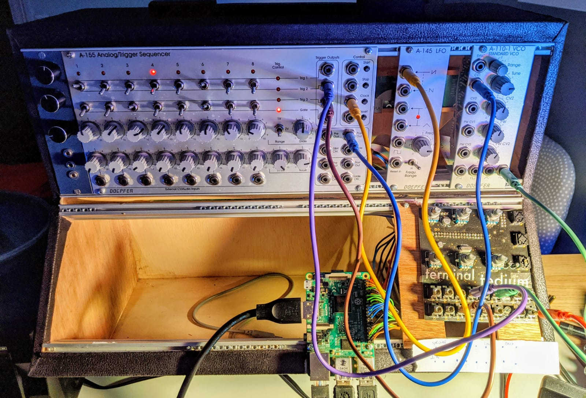
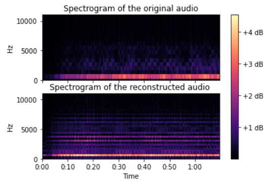
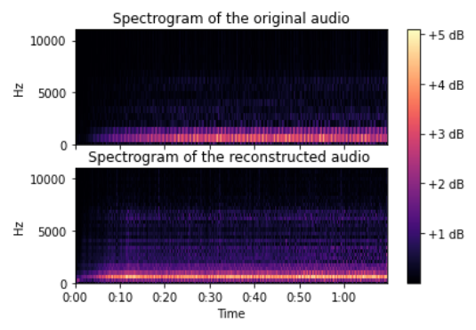

# Machine Learning Modular Synthesizer

This project aims at embedding a Deep Generative model of audio in a small computer (Raspberry Pi). We create a communication between a Modular Synthesizer and the computer to control the parameters of the Deep model. That way, our modular synthesizer will be able to send a signal and receive another one from the computer. The computer is transformed into a modular Rack module...

1. We first reimplemented a Deep model : the Differentiable Ditital signal processing (DDSP) developped by magenta. 

2. We then tried to lighten the model with pruning and trimming method, since Deep models are usually very heavy and need a strong computer to be run.

3. We worked on an architecture to create the communication between the hardwares (Modular synthesizers, Raspberry, Terminal Tedium) and the softwares (PureData, Python). 

## 1. The DDSP

The Differentiable Digital Signal Processing relies on additive synthesis thanks to several oscillator and subtractive synthesis with noise filtering. Thus, the last part of the model can be seen as a synthesizer and the neural network aims at learning the parameters controling the synthesizer module. 

The model is trained with instrument samples (wav files) and tries to learn the parameters provided to the synthesizer part in order to produce the sample. Then we compare the reconstructed sound with the original sample by calculating a multi-scale spectogram loss. 

### Original sample n°1
<audio controls>
  <source src="samples/origin.mp3" type="audio/mp3">
Your browser does not support the audio element.
</audio>

### Reconstructed sample n°1
<audio controls>
  <source src="samples/reconstruit.mp3" type="audio/mp3">
Your browser does not support the audio element.
</audio>

### Original sample n°2
<audio controls>
  <source src="samples/test2_original.mp3" type="audio/mp3">
Your browser does not support the audio element.
</audio>

### Reconstructed sample n°2
<audio controls>
  <source src="samples/test2_reconstucted.mp3" type="audio/mp3">
Your browser does not support the audio element.
</audio>

### Original sample n°3
<audio controls>
  <source src="samples/test3_original.mp3" type="audio/mp3">
Your browser does not support the audio element.
</audio>

### Reconstructed sample n°3
<audio controls>
  <source src="samples/test3_reconstucted.mp3" type="audio/mp3">
Your browser does not support the audio element.
</audio>

## Timbre transfer with Daft Punk Vocal Sample 

Trained on violin sample, the DDSP learnt the timbre of the violin. To experiment it, we loaded the vocal and generated a new audio sample with the trained DDSP model.
<audio controls>
  <source src="samples/better_daft" type="audio/mp3">
Your browser does not support the audio element.
</audio>

<audio controls>
  <source src="samples/better_daft_reconstructed.mp3" type="audio/mp3">
Your browser does not support the audio element.
</audio>

## 2. Pruning/Trimming

## 3. The Communication
