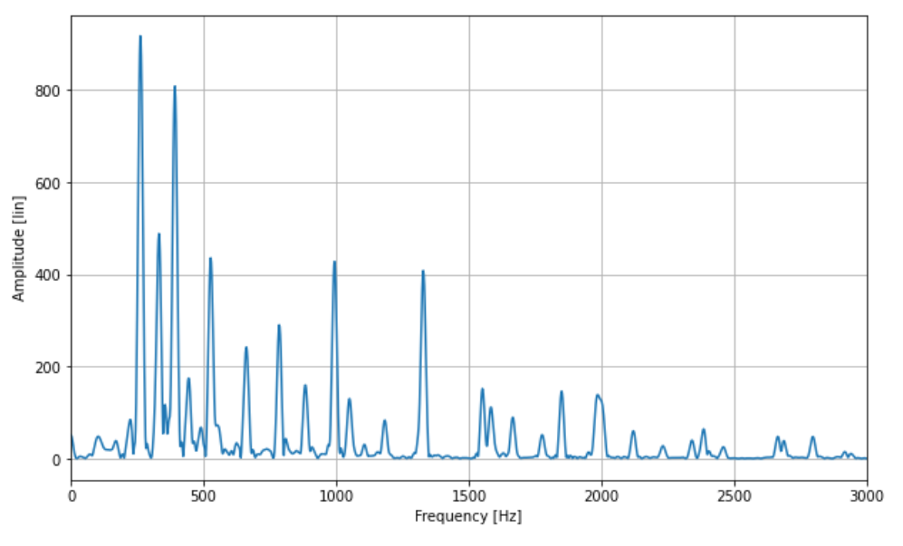

# Spectral Product Algorithm 

### We are going to estimate the F0 of this piano sample

<audio controls>
  <source src="samples/A3C4E4G4_piano.mp3" type="audio/mp3">
Your browser does not support the audio element.
</audio>

The spectral product is calculated by multiplying H compressed versions of the spectrum. Let's call $f_k = \frac{k}{N_{fft}}$ the discrete frequency of the DFT, we have \begin{equation}
    P(f_k) = \prod_{h=1}^{H} |X(f_k h)|
\end{equation}
We calculate the DFT frequencies and amplitudes with the Fast Fourier Transform algorithm.

We then calculate the vectors containing the spectral product frequencies and amplitudes. 
### Source loudness and its reconstruction for sample n°5

The F0 is the value that has the maximum amplitude y and the minimum frequency
