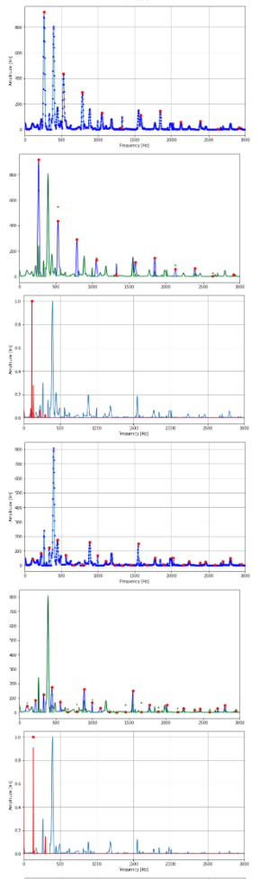
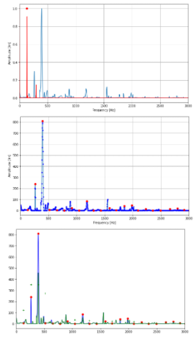

# Spectral Product Algorithm 

### We are going to estimate the F0 of this piano sample

<audio controls>
  <source src="samples/A3C4E4G4_piano.mp3" type="audio/mp3">
Your browser does not support the audio element.
</audio>


The spectral product is calculated by multiplying H compressed versions of the spectrum. Let's call 
```math
f_k = \frac{k}{N_{fft}}
```


the discrete frequency of the DFT, we have 
\begin{equation}
    P(f_k) = \prod_{h=1}^{H} |X(f_k h)|
\end{equation}

We calculate the DFT frequencies and amplitudes with the Fast Fourier Transform algorithm.

We then calculate the vectors containing the spectral product frequencies and amplitudes. 
### Source loudness and its reconstruction for sample n°5


# Find the maximum of the spectral product

# We then calculate the vectors containing the spectral product frequencies and amplitudes. 
### Source loudness and its reconstruction for sample n°5


When the signal is polyphonic, we have a superposition of several harmonic spectrum. The idea is to subtract the harmonic spectrum that corresponds to the f0 we estimated. In order to do so, we need to know where the different harmonics of the fundamental frequency are. The idea is to look for the maximum of the spectrum around each theorical harmics of frequency 

$f_h = h \cdot f_0$.


# Substraction of the harmonics
In order to better discern the sounds that are in harmonic relation (and especially the sounds at the octave level) it is preferable not to totally subtract a sound from the mixture, but to try to subtract only its contribution at the level of each harmonic. For this, the principle of spectral smoothness is used. We calculate a smoothed harmonic spectrum where the amplitude of the spectrum at each harmonic $f_h$ is replaced by the average of the amplitudes of the harmonics $f_{h-1}$, $f_h$ and $f_{h+1}$.


# Stop criterion

The previous steps are then iterated until a certain stopping criterion is verified.







